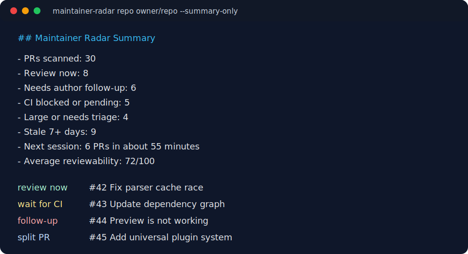

# Maintainer Radar

[](https://github.com/JackSpiece/maintainer-radar/actions/workflows/ci.yml)

Local-first pull request triage reports for maintainers in the AI contribution era.



Maintainer Radar turns GitHub pull request metadata into a short, deterministic
review brief: which PRs are ready to review, which ones need author follow-up,
which ones are blocked by CI, and which ones are too risky to merge without more
evidence.

It is not a review bot and it does not require a GitHub App. It runs from your
terminal, uses the GitHub CLI when live data is needed, and can also analyze JSON
fixtures offline.

## Why This Exists

Maintainers are getting more drive-by and AI-assisted PRs. The hard part is not
only reading code. It is deciding where review time is worth spending.

Maintainer Radar focuses on that first 60 seconds:

- Is the PR small enough to review?
- Did CI pass?
- Did the author include a test plan?
- Are tests changed when code changed?
- Did a maintainer already say "not working" or request changes?
- Is this stale enough that it needs a fresh author response?
- Is this a review-now PR or a follow-up-needed PR?

## What Makes It Different

Most tools in this area are AI reviewers, GitHub Apps, bounty boards, or generic
dashboards. Maintainer Radar is different on purpose:

- **Maintainer-first:** it prioritizes review time, not contributor output.
- **Local-first:** no SaaS, no webhook, no hosted database.
- **Deterministic:** every flag comes from transparent heuristics.
- **AI-era aware:** it catches the common failure shape of large PRs with weak
  test evidence and unresolved maintainer feedback.
- **Markdown-native:** output can be pasted into issues, PR comments, worklogs,
  release notes, or maintainer handoff docs.

## Install

From a checkout:

```bash
python -m pip install -e .
python -m unittest discover -s tests
```

Or run without installing:

```bash
PYTHONPATH=src python -m maintainer_radar --help
PYTHONPATH=src python -m unittest discover -s tests
```

Live GitHub commands require the GitHub CLI:

```bash
gh auth login
```

## Usage

Analyze open PRs in a repository:

```bash
maintainer-radar repo owner/repo --limit 20
```

Filter noisy queues:

```bash
maintainer-radar repo owner/repo --label bug --stale-days 14
maintainer-radar repo owner/repo --author contributor --updated-since 2026-06-01
```

Get a compact queue snapshot:

```bash
maintainer-radar repo owner/repo --summary-only
```

Focus a report on the most reviewable PRs:

```bash
maintainer-radar repo owner/repo --action review-now --min-score 80
maintainer-radar from-json queue.json --max-risk 25
```

Analyze one PR in detail:

```bash
maintainer-radar pr owner/repo 123
```

Track one contributor's open PRs:

```bash
maintainer-radar author JackSpiece --state open --limit 50
```

Analyze offline JSON:

```bash
maintainer-radar from-json examples/sample-prs.json
```

JSON output is available for automation:

```bash
maintainer-radar repo owner/repo --format json
```

## Example Output

```markdown
## Maintainer Radar Report

| PR | Action | Score | Signals |
| --- | --- | ---: | --- |
| #42 Fix parser cache race | review now | 88 | CI passed, test plan present, tests changed |
| #43 Add universal plugin system | request smaller PR | 41 | very large diff, no tests changed, review blockers |
```

## Signals

Maintainer Radar currently checks:

- draft PRs
- review decision
- CI state
- stale update windows
- additions, deletions, and changed file count
- body test-plan language
- code changes without nearby tests
- generated file paths and lockfiles
- maintainer comments that look like blockers
- failing or pending checks

The goal is not to replace review. The goal is to route attention.

## Project Status

This is an early public release. The core CLI, scoring engine, Markdown renderer,
offline JSON mode, and tests are present. Next work is focused on better GitHub
query coverage, richer maintainer blocker detection, and examples from real OSS
review workflows.

See [ROADMAP.md](ROADMAP.md).

For copy-paste maintainer workflows, see
[docs/handoff-examples.md](docs/handoff-examples.md).

For scheduled queue reports, see [docs/github-actions.md](docs/github-actions.md).

For scoring details, see [docs/heuristics.md](docs/heuristics.md).

## Contributing

Issues and PRs are welcome, especially:

- better heuristics for maintainer feedback
- fixtures from real open-source review patterns
- integrations with `gh`, GitLab, Forgejo, or static JSON exports
- examples that help maintainers adopt the tool without workflow churn

See [CONTRIBUTING.md](CONTRIBUTING.md).

## License

MIT
